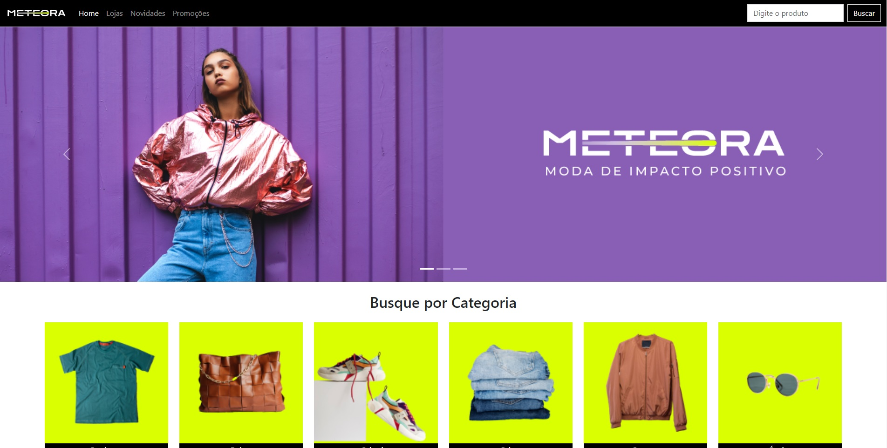

<h1 align="center"> Meteora | Alura </h1>

Site criado atráves do curso de Bootstrap do ALura.

  <a href="#-tecnologias">Tecnologias</a>&nbsp;&nbsp;&nbsp;|&nbsp;&nbsp;&nbsp;
  <a href="#-projeto">Projeto</a>&nbsp;&nbsp;&nbsp;

 

  

## 🚀 Tecnologias

Esse projeto foi desenvolvido com as seguintes tecnologias:

- HTML e CSS
- Bootstrap 5
- Git e Github

## 💻 Projeto

O site meteora é um projeto de uma loja de roupas virtual, criado para a prática e aprendizado do Bootstrap.
Realizado através do curso de Bootstrap da Alura.
 
 
Acesse o site em [Live](https://andeilso.github.io/nlw-10-copa/) no Vercel.

##
